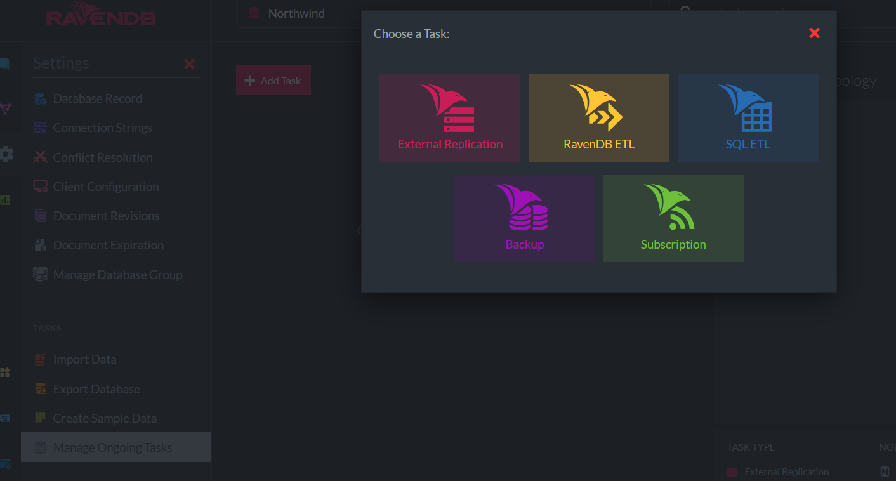

# Unit 3, Lesson 6 - Data Subscriptions - I would like to be notified when <IMPORTANT EVENT> happens, pls

That was a long journey. Am I right? We are in the last lesson of this bootcamp.

You already know the basics about how to use RavenDB and you are ready to move on. Please,
note that there is an [extensive documentation](http://ravendb.net/docs) available online. Probably
you want to know about clustering, for example. Thare is much more to learn than we covered here.

In this last lesson, you will learn how to work with Data Subscriptions.

## Data Subscriptions?

It's simpler to explain this concept with an example. Consider the following query:

```
from Orders 
where Lines.length > 5
```

This would retrieve all the big orders from your database. But, what if a new big order 
is added after you run this query. What if you want to be notified whenever a big order
occurs? YEAH! THIS IS WHAT I WAS TALKING ABOUT.

## Exercise: Creating a Data Subscription

I assume that, at this point, you know how to open the Studio and the Northwind database.

Go do that! I will wait...

Done?!

Now, to create a Data Subscription you need to open the `Settings` section of your database,
click on the `Manage Ongoing Tasks` option, then click on the `Add Task` button.



Now, click on `Subscription`.

RavenDB is asking you a Task Name (let's call it `Big Orders`) and let's provide the very
same query we used before.


The user interface allows me to do a test before save (I did it!). 

Save it!

## Exercise: Subscribing the Data Subscription

In this exercise, you will learn how to subscribe and consume a 
data subscription.

>Data subscriptions are consumed by clients, called subscription workers. 
In any given moment, **only one worker can be connected to a data subscription**. 
A worker connected to a data subscription receives a batch of documents and gets to process it. 
When it's done (depends on the code that the client gave the worker, can take from seconds to hours), 
it informs the server about the progress and the server is ready to send the next batch.

### Step 1: Create a new project and install the latest `RavenDB.Client` package

Start Visual Studio and create a new `Console Application Project` named
`BatchOperationsWithRavenDB`. Then, in the `Package Manager Console`, issue the following
command:

```Install-Package RavenDB.Client```

### Step 2: Initialize the `DocumentStore`

Here we go again. let's manage the `DocumentStore` using our great friend `DocumentStoreHolder` pattern.  

````csharp
using System;
using Raven.Client;
using Raven.Client.Document;
using Raven.Client.Indexes;

namespace BatchOperationsWithRavenDB
{
    public static class DocumentStoreHolder
    {
        private static readonly Lazy<IDocumentStore> LazyStore =
            new Lazy<IDocumentStore>(() =>
            {
                var store = new DocumentStore
                {
                    Urls = new[] { "http://localhost:8080" },
                    Database = "Northwind"
                };

                return store.Initialize();
            });

        public static IDocumentStore Store =>
            LazyStore.Value;
    }
}
````

### Step 3: Subscribing...

Subscriptions are consumed by processing batches of documents received from the server. 
To do this, we need to get an instance of `SubscriptionWorker`.

```csharp
static void Main(string[] args)
{
    var subscriptionWorker = DocumentStoreHolder.Store
        .Subscriptions
        .GetSubscriptionWorker<Order>("Big Orders");

    var subscriptionRuntimeTask = subscriptionWorker.Run(batch =>
    {
        foreach (var order in batch.Items)
        {
            // business logic here.
            Console.WriteLine(order.Id);
        }
    });

    WriteLine("Press any key to exit...");
    ReadKey();
}
```

## How Data Subscriptions work?

There are some important facts that you need to know to use this feature correctly.

* Documents that match a pre-defined criteria are sent in batches from the server to the client.
* The client sends an acknowledgment to the server once it is done with processing the batch.
* The server keeps track of the latest document that was acknowledged by the client, so that processing can be continued from the latest acknowledged position if it was paused or interrupted.

## Great job! That's all.
Wow! You made it! At this point you already know the basics of RavenDB. Congratulations! Again, you can learn more using the [documentation](http://ravendb.net/docs) available online.

Thanks for using this bootcamp to learn RavenDB.
